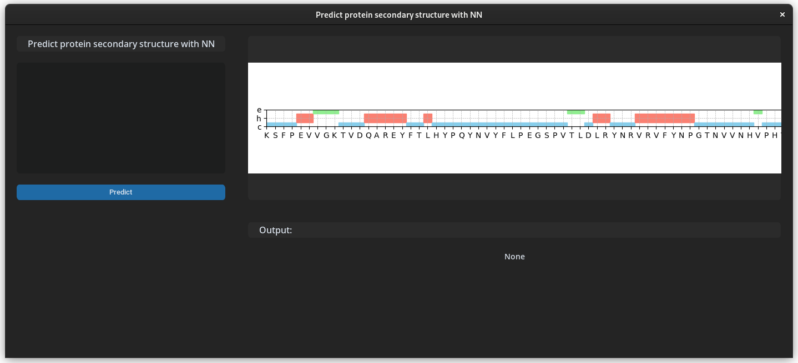
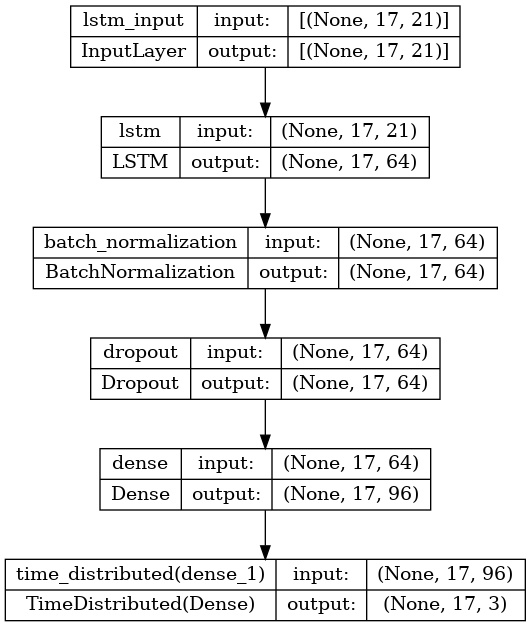

# MOL3022 - Predicting Secondary Structure of a Protein using NN

## Description
This repository includes a Python based software to predict the secondary structure of a protein by using a neural network.

It uses dataset from: Sejnowski,Terry and Qian,Ning. Molecular Biology (Protein Secondary Structure). UCI Machine Learning Repository. [doi.org](https://doi.org/10.24432/C5SP4F).

### Model architecture

### Results

## Requirements
The software was tested successfully with Python version >= 3.9.0.

There are no platform-specific requirements.

There are no specific hardware requirements.

## How to use

Install the required packages by:
> pip install -r requirements.txt
 
Run the Python file:
> python main.py

### GUI
Enter the protein sequence in the input field and click on the "Predict" button. The predicted secondary structure will be displayed in the output field and as a graph.
