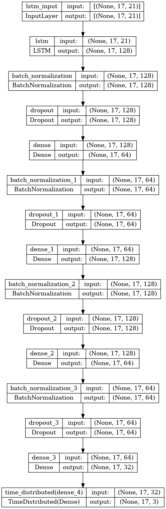
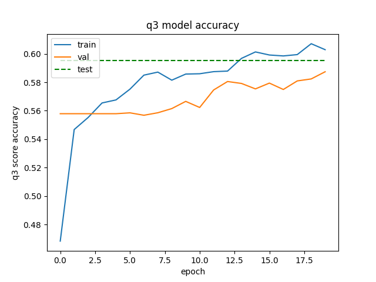

# MOL3022 - Predicting Secondary Structure of a Protein using NN

## Description
This repository includes a Python based software to predict the secondary structure of a protein by using a neural network.

It uses dataset from: Sejnowski,Terry and Qian,Ning. Molecular Biology (Protein Secondary Structure). UCI Machine Learning Repository. [doi.org](https://doi.org/10.24432/C5SP4F).

### Model architecture

### Results
__Note that the results may vary slightly between computers as there is stochasticity involved.__
loss: 0.8880 - accuracy: 0.5954 - mae: 0.3597 - q3_score: 0.5954

## Requirements
The recommended version of Python is 3.11.0.
Other versions > 3.9.0 should work as well, but may not be supported by the requirements.txt file.

There are no platform-specific requirements.

There are no specific hardware requirements.

## How to use

Install the required packages by:
> pip install -r requirements.txt
 
Run the Python file:
> python main.py

### GUI
Enter the protein sequence in the input field and click on the "Predict" button. The predicted secondary structure will be displayed in the output field and as a graph.

## Note about reproducibility

The repository includes a pretrained model which gives a Q3 accuracy of 0.5953635573387146. However, even with setting the seed to control the random processes in the training, it is deterministic within the same hardware but not possible to reproduce the same accuracy across machines. The accuracy does not vary much, but can be +- 5% different depending on the different machines it is trained on.
